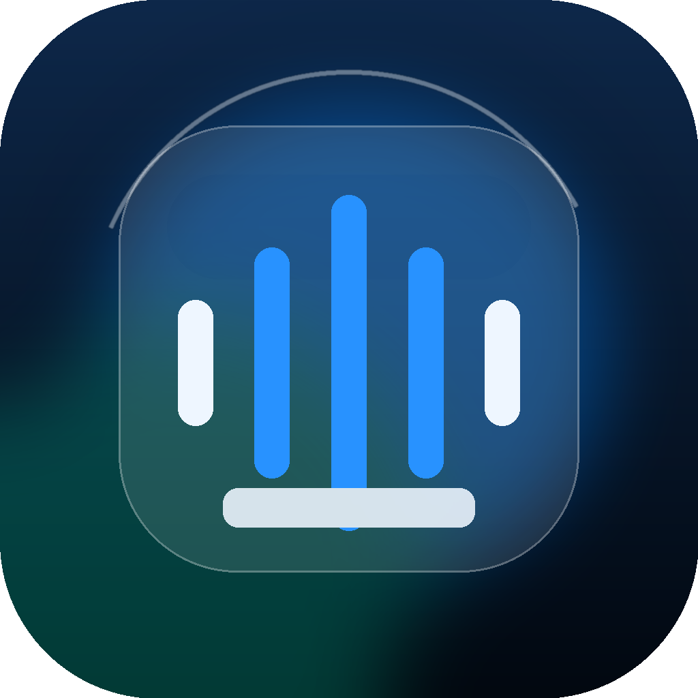

<p align="center">
  
</p>

<h1 align="center">PureMP3</h1>

<p align="center">
  A small macOS app for honest, high-quality audio conversion.
</p>

<p align="center">
  <a href="https://github.com/peterdsp/PureMP3/actions"></a>
  
  
  
</p>

PureMP3 converts video and audio files to MP3 or lossless FLAC without hiding the tradeoffs behind vague compression claims.

Drop files into the queue, choose a real quality preset, pick an output folder, then convert. The app shows the FFmpeg command it will run and warns when a source is already a lossy MP3.

## Current Design

PureMP3 is now a compact, fixed-size macOS window built around the conversion queue.

- The header keeps the product title, display mode switcher, Add files, and Convert actions visible.
- The left sidebar contains quality presets, output folder selection, and the bitrate truth note.
- The main panel is either a drop target empty state or the active conversion queue.
- Queue rows show input names, output names, duration when available, lossy MP3 warnings, and conversion status.
- The bottom command bar previews the exact FFmpeg command for the first queued file.
- The window supports two display modes: Glass and OLED.

The interface is intentionally narrow in scope. Quality, output, queue state, and command visibility stay on one screen.

## Highlights

- Drag audio or video files into the app, or add them with the file picker
- Convert MP4, M4A, WAV, FLAC, and MP3 inputs to MP3 or lossless FLAC
- Use FLAC Lossless Ultra or LAME presets for VBR Best, VBR Balanced, 320 kbps, 256 kbps, and 192 kbps
- Switch between translucent Glass surfaces and a darker OLED mode
- Preview the FFmpeg command before conversion
- Warn before re-encoding an already lossy MP3
- Choose the output directory from the app
- Reveal completed output files in Finder
- Bundle FFmpeg and ffprobe inside release builds
- Keep conversion policy in a tested Swift core module

## Why

MP3 file size is mostly:

```text
duration x bitrate
```

If you keep real 320 kbps CBR MP3 quality, you cannot meaningfully shrink the file without changing something important:

- lower the bitrate
- use high-quality VBR
- change format
- re-encode and lose more quality

PureMP3 makes those tradeoffs explicit.

## Quality Presets

| Preset | FFmpeg settings | Use when |
| --- | --- | --- |
| Lossless Ultra | `-vn -codec:a flac -compression_level 12` | You want lossless FLAC output and accept larger files |
| VBR Best | `-vn -codec:a libmp3lame -q:a 0` | You want the highest LAME VBR quality, usually smaller than fixed 320 kbps |
| VBR Balanced | `-vn -codec:a libmp3lame -q:a 2` | You want the best practical default |
| 320 kbps | `-vn -codec:a libmp3lame -b:a 320k` | You need the maximum fixed MP3 bitrate |
| 256 kbps | `-vn -codec:a libmp3lame -b:a 256k` | You want very good music quality with smaller files |
| 192 kbps | `-vn -codec:a libmp3lame -b:a 192k` | You want a good general-purpose output size |

## The Rule PureMP3 Will Not Break

PureMP3 will not claim fake compression.

This is wrong:

```bash
ffmpeg -i myfile.mp3 -b:a 320k smaller.mp3
```

That re-encodes an already lossy MP3 into another MP3. It can lose quality, but it cannot restore quality or create a meaningfully smaller true 320 kbps file.

This is usually the better choice:

```bash
ffmpeg -i myfile.mp4 -vn -codec:a libmp3lame -q:a 2 myfile.mp3
```

## FFmpeg

PureMP3 is built to ship with FFmpeg and ffprobe inside the app bundle, so normal users do not need Homebrew, Terminal, or a separate FFmpeg install.

Release app layout:

```text
PureMP3.app/Contents/Resources/FFmpeg/bin/ffmpeg
PureMP3.app/Contents/Resources/FFmpeg/bin/ffprobe
```

Developer builds also support:

- `PUREMP3_FFMPEG_DIR`
- `/opt/homebrew/bin`
- `/usr/local/bin`
- `/usr/bin`

For release packaging, see [Docs/DISTRIBUTION.md](Docs/DISTRIBUTION.md).

## Build

```bash
git clone https://github.com/peterdsp/PureMP3.git
cd PureMP3
swift build
swift run PureMP3
```

To build a local `.app` bundle with the icon and bundled FFmpeg lookup:

```bash
script/download_ffmpeg_macos_arm64.sh
script/build_and_run.sh --verify
```

To create a local zipped app archive:

```bash
script/package_release.sh
```

## Test

```bash
swift test
```

## Architecture

PureMP3 is split into two layers:

```text
PureMP3
+-- Sources
|   +-- PureMP3App
|   |   +-- SwiftUI views
|   |   +-- app state
|   |   +-- shell FFmpeg client
|   +-- PureMP3Core
|       +-- presets
|       +-- command building
|       +-- ffprobe parsing
|       +-- size estimation
+-- Tests
    +-- PureMP3CoreTests
```

The rule is simple: conversion policy belongs in `PureMP3Core`. The app can change shape, but the audio behavior stays tested.

For more detail, see [Docs/ARCHITECTURE.md](Docs/ARCHITECTURE.md).

## Roadmap

- Progress parsing from FFmpeg stderr
- Drag-to-reorder queue
- Conversion cancellation
- Metadata and album art preservation
- Opus, AAC, FLAC, and WAV outputs
- Homebrew cask
- Signed and notarized releases
- Localized interface
- Release pipeline for signed app bundles with bundled FFmpeg

## Contributing

Contributions are welcome if they keep the app honest, small, and useful.

Good contributions:

- improve conversion correctness
- add tests around command generation
- make the UI clearer without adding clutter
- improve accessibility
- document real audio tradeoffs

Avoid:

- fake quality claims
- growth into a generic video editor
- hidden re-encoding behavior
- adding dependencies without a strong reason

## License

PureMP3 is MIT licensed.

Bundled FFmpeg binaries keep their own license. FFmpeg licensing depends on the build configuration, so releases must include the correct FFmpeg notices, source links, and LGPL or GPL obligations.
