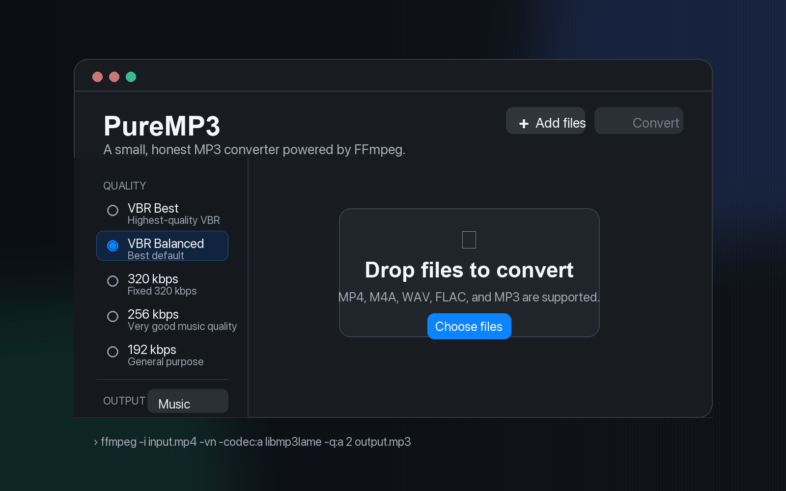

<p align="center">
  
</p>

<h1 align="center">PureMP3</h1>

<p align="center">
  A minimal macOS app for honest, high-quality MP3 conversion.
</p>

<p align="center">
  <a href="https://github.com/peterdsp/PureMP3/actions"></a>
  
  
  
</p>

PureMP3 is a small macOS app for converting video and audio files to MP3 without pretending that lossy audio has magic compression rules.

It exists because converting a video to a clean MP3 should not require remembering FFmpeg flags, opening a heavyweight encoder, or pretending that a 320 kbps MP3 can be magically compressed while staying truly 320 kbps.

Drop files in. Pick a quality preset. Convert.

## Demo

<p align="center">
  
</p>

## Highlights

- Drop audio or video files into a focused conversion queue
- Pick real LAME presets without digging through FFmpeg docs
- Use VBR Best, VBR Balanced, 320 kbps, 256 kbps, or 192 kbps
- See the exact command PureMP3 will run
- Get warned before re-encoding an already lossy MP3
- Keep the conversion policy in a tested Swift core module

## Why

MP3 file size is mostly:

```text
duration x bitrate
```

If you keep real 320 kbps CBR MP3 quality, you cannot meaningfully shrink the file without changing something important:

- lower the bitrate
- use high-quality VBR
- change format
- re-encode and lose more quality

PureMP3 makes those tradeoffs explicit.

## What It Does

- Converts video and audio files to MP3
- Supports high-quality LAME presets
- Shows the exact FFmpeg command
- Warns when the source is already MP3
- Keeps the interface intentionally small
- Uses a testable Swift core instead of hiding behavior inside the UI

## Interface

PureMP3 is designed to stay out of the way:

- the queue is the product, not a settings maze
- quality choices are visible before conversion starts
- warnings are attached to the file they affect
- the FFmpeg command is visible instead of hidden behind a black box

## Quality Presets

| Preset | FFmpeg settings | Use when |
| --- | --- | --- |
| VBR Best | `-codec:a libmp3lame -q:a 0` | You want excellent quality and smaller files than fixed 320 kbps |
| VBR Balanced | `-codec:a libmp3lame -q:a 2` | You want the best practical default |
| 320 kbps | `-codec:a libmp3lame -b:a 320k` | You need maximum fixed MP3 bitrate |
| 256 kbps | `-codec:a libmp3lame -b:a 256k` | You want very good music quality with smaller files |
| 192 kbps | `-codec:a libmp3lame -b:a 192k` | You want a good general-purpose output size |

## The Rule PureMP3 Will Not Break

PureMP3 will not claim fake compression.

This is wrong:

```bash
ffmpeg -i myfile.mp3 -b:a 320k smaller.mp3
```

That re-encodes an already lossy MP3 into another MP3. It can lose quality, but it cannot restore quality or create a meaningfully smaller true 320 kbps file.

This is usually the better choice:

```bash
ffmpeg -i myfile.mp4 -vn -codec:a libmp3lame -q:a 2 myfile.mp3
```

## Install FFmpeg

PureMP3 uses your local FFmpeg installation.

```bash
brew install ffmpeg
```

PureMP3 currently looks for FFmpeg in:

- `/opt/homebrew/bin`
- `/usr/local/bin`
- `/usr/bin`

## Build

```bash
git clone https://github.com/peterdsp/PureMP3.git
cd PureMP3
swift build
swift run PureMP3
```

## Test

```bash
swift test
```

## Architecture

PureMP3 is split into two layers:

```text
PureMP3
├── Sources
│   ├── PureMP3App
│   │   ├── SwiftUI views
│   │   ├── app state
│   │   └── shell FFmpeg client
│   └── PureMP3Core
│       ├── presets
│       ├── command building
│       ├── ffprobe parsing
│       └── size estimation
└── Tests
    └── PureMP3CoreTests
```

The rule is simple: conversion policy belongs in `PureMP3Core`. The app can change shape, but the audio behavior stays tested.

## Roadmap

- Real captured screenshots for each release
- Progress parsing from FFmpeg stderr
- Drag-to-reorder queue
- Conversion cancellation
- Metadata and album art preservation
- Opus, AAC, FLAC, and WAV outputs
- Homebrew cask
- Signed releases
- Localized interface
- Optional bundled FFmpeg build with clear license handling

## Contributing

Contributions are welcome if they keep the app honest, small, and useful.

Good contributions:

- improve conversion correctness
- add tests around command generation
- make the UI clearer without adding clutter
- improve accessibility
- document real audio tradeoffs

Avoid:

- fake quality claims
- growth into a generic video editor
- hidden re-encoding behavior
- adding dependencies without a strong reason

## License

PureMP3 is MIT licensed.

FFmpeg is not bundled in this repository. If that changes, release packaging must respect FFmpeg and codec licensing.
